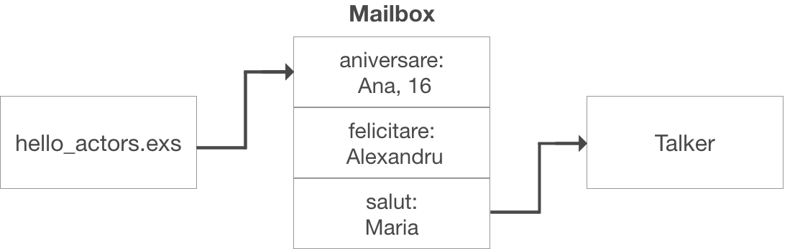

# Cuprins

1. Modelul de Actori (5 min) 
2. Limbajul si sintaxa Elixir (10 min) 
3. Exemple practice (10 min)
4. Studiu de caz (5 min)


# Modelul de Actori

[Hewitt, Meijer and Szyperski: The Actor Model](https://www.youtube.com/watch?v=1zVdhDx7Tbs)

Incepem cu un high-level overview.

Unitatea fundamentala de computatie. Laturi esentiale:

- procesare
- stocare
- comunicare

>  One actor is no actor

Fiecare actor are o adresa si un mailbox. Un actor poate trimite mesaje altuia. Cand isi trimite siesi se numeste recursie.

Cand un actor primeste un mesaj, el poate:

- creea alti actori
- trimite mesaje actorilor cunoscuti
- defini ce face cu urmatorul mesaj
- targeteaza arhitecturi cu memorie partajata si distribuita


Programare functionala: evita stare mutabila. Programare cu actori: mentine stare mutabila dar nu o partajeaza.


"Atribuire" prin tail-recursion (ultima actiune din functie).


Nu este garantata pastrarea ordinii trimiterii mesajelor la primire.

Mesajele sunt trimise direct, nu printr-un canal ➡ fara overhead.


Model computational *configuration-based* in loc de *state-machine*. Un mesaj *se duce*, nu ajunge instant dintr-o stare in alta. 

Mai fidel unui model fizic decat unuia algebric.


Fata de modelul de calcul Turing, care permite *nedeterminism bounded*, modelul de Actori permite *indeterminism unbounded* — un request poate lua oricat timp sa ajunga la server, *arbitrul* sa il aleaga si sa se intoarca raspunsul.


Sincronizarea este condusa de faptul ca mesajele sunt procesate cate unul. 


TODO: https://en.wikipedia.org/wiki/Actor_model


## Implementare in Elixir

**Actor** = process

**Adresa** = PID (process identifier)

**Mesaj** = tuplu  `{:set, "Popescu", 500}`

**Mailbox** = coada


# Elixir

- Limbaj functional
  - functii ca first class citizen
  - accent pe recursie higher-order functions
  - imutabilitate date
- Tipuri dinamice (inferenta la runtime)
- Lightweight concurrency
  - "shared nothing" actors
  - message passing
- Orientat-proces
- Construit peste Erlang
  - compileaza in bytecode pt Erlang Virtual Machine (BEAM)
- A aparut in 2011
- Gandit pt scalare — tolerant la erori
- Exemplu: Pinterest 


## Sintaxa

[Documentatie Elixir](https://elixir-lang.org/getting-started/introduction.html)

Ne concentram pe concepte, dar trebuie sa stim si sintaxa

```elixir
$ iex  # Elixir shell
> # expresie
```


### Tipuri

```elixir
5            # int
2.0          # float
true         # boolean
:symb        # atom
"str"        # string
["a", 1, 2]  # lista
{:a, 5.2}    # tuplu
nil          # valoare nula
~r/[a-z]/i   # regex

# keyword list
> dict = [cheie: "valoare", secret: 123]
> dict[:secret]
123

# map
> map = %{"a" => true, 102 => false}  # cheia poate fi orice tip
> map[102]
false
```


### Operatori

```elixir
# aritmetici
> 1 + 2
3
> 7 / 2
3.5  # mereu float, pt trunchiere, exista functiile div si rem

# comparare
> 0 <= 1
true
> 0 == 1
false

# logici
> true or 0/0 == 0  # scurtcircuitare
true

# pe string-uri
> "abc {:def}"  # interpolare
"abc def"
> "he" <> "llo"
"hello"
> "Hello" =~ ~r/[a-z]/i  # regex match
true

# pe liste
> [1, 2] ++ [3]
[1, 2, 3]
> [1, 2, 3] -- [2]
[1, 3]
```


### Variabile

```elixir
# refolosire
> var = 2
2
> var = 3  
3

# ; sau newline delimiteaza expresii
> y = 10; x+y  
13
```


### Pattern matching

Operatorii `=` si `^`.

```elixir
> x = 1
1
> x
1

# variabile
> 1 = x
1
> 2 = x
MatchError

# tupluri
> {a, b, c} = {:hello, "world", 42}
> a
:hello
> b
"world"
> {a, b, c} = {:hello, "world"}
MatchError

# liste
> [a, b, c] = [1, 2, 3]
> a
1

> [head | tail] = [1, 2, 3]
> head
1

# operator pin
> x = 1
> ^x = 2
MatchError

> {y, ^x} = {2, 1}  # transformat in {y, 1} = {2, 1}
> y
2
> {y, ^x} = {2, 2}  # transformat in {y, 1} = {2, 2}
MatchError
```

`^x` in loc sa ii lege `x` valoarea din partea dreapta, foloseste valoarea existenta a lui `x` pt a face matching.


### Branching

Trei structuri de control: `case`, `cond` si `if`.

```elixir
# case (haskell: case .. of ..)
case {1, 2, 3} do
  {1, x, 3} when x > 0 -> "match-uiteste"
   _                   -> "otherwise"
end

# functie anonima
f = fn
  x, y when x > 0 -> x + y
  x, y            -> x * y
end

# cond (multiple if, else if)
cond do
  0 == 1 -> "nu match-uiteste"
  5 < 77 -> "aici da"
end

# if
if nil do
  "niciodata"
else
  "aici"
end

# ca functii
if true, do: 5, else: :altceva
```


### Functii

Functiile sunt identificate dupa nume si aritate. Functiile sunt grupate intr-un modul.

```elixir
defmodule Modul do
  @atribut "constant"
  
  def sum(a, b) do
    a + b
  end
  
  # functie privata, argument implicit
  defp private(x \\ "default") do
    x <> "!"
  end
  
  # pattern matching, guards, keyword list form
  def zero?(0), do: true
  def zero?(x) when is_integer(x), do: false
end

> Modul.sum(2, 3)
5
> Modul.private("a")  # la fel si la Modul.atribut
** UndefinedFunctionError


# functie anonima
> f = &(&1 * &2) 
> f.(2, 3)
6
```

Toate built-in-urile din Erlang sunt in modulul `:erlang`.


### Enumerabile


```elixir
# list comprehension, in Haskell: [n^2 | n <- [1..5], odd n]
> for n <- [1, 2, 3, 4, 5], rem(n, 2) == 1, do: n*n
[1, 9, 25]

> odd? = &(rem(&1, 2) != 0)
# range, pipe, higher order functions
> 1..100_000 |> Enum.map(&(&1 * 3)) |> Enum.filter(odd?) |> Enum.sum
7500000000

# toate numerele pitagoreice
# ie, {a, b, c} aî a^2 + b^2 = c^2
> def pythagorean(n) when n > 0 do  
    # list comprehension
    for a <- 1..n,  # produs cartezian [1..n]^3
        b <- 1..n,
        c <- 1..n,
        a + b + c <= n,  # doua filtre
        a*a + b*b == c*c,
        do: {a, b, c}
  end
```

Functiile din modulul `Enum` sunt eager. Modulul `Stream` are echivalentele lor in varianta lazy (ca in Haskell).


### Procese

Izolate, ruleaza concurent, comunica prin mesaje. Ca si in Erlang, sunt foarte lightweight — consuma putine resurse & timp de pornire mic (mai putine decat thread-urile din alte limbaje.

```elixir
> pid = spawn fn -> 1 + 2 end  # proces ruleaza o functie
PID<0.100.0>  # returneaza pid-ul
> Process.alive?(pid)
false  # a terminat deja de rualt 1 + 2

> send self, {:hello, "fmi"}  # trimite un mesaj siesi
> send self, {:hello, "ub"}   # pune in continuare in mailbox
> receive do  # citeste primul mesaj din mailbox
    {:hello, name} -> "salut, #{name}"
    {:bye,   name} -> "nu match-uieste"
  after
    3_000 -> "nimic dupa 3s"
  end
"salut, fmi"
> flush  # goleste mailbox-ul si printeaza mesajele
{:hello, "ub"}
:ok
```


Este in regula ca procesele sa esueze. Ne asteptam ca supervizorii sa se ocupe de restartarea lor. Legam un supervizor prin primitiva `spawn_link/0`.

```elixir
> spawn_link fn -> raise "eroare" end  # ii setam procesului ca supervizor shell-ul
PID<0.77.0>
RuntimeError eroare (from PID<0.77.0>)
```


### ?Stare

Un proces care ruleaza permanent cu `loop`. *Starea* este un dictionar pasat prin argumente. Operatiile de citire/scriere sunt tratate de mesaje ce incep cu `:get` / `:set`

```elixir
# kv.exs
defmodule KV do  # KeyValue
  @doc "dictionar cheie-valoare"

  def start_link do
    start_link(fn -> loop(%{}) end) # incepem cu un dictionar gol
  end

  defp loop(map) do
    receive do
      {:get, key, caller} ->
        send caller, Map.get(map, key)  # raspundem apelantului
        loop(map)                       # continuam sa asteptam mesaje
      {:put, key, value} ->
        loop(Map.put(map, key, value))  # actualizam modificand argumentul
    end
  end
end
```


```elixir
$ ies kv.exs  # executam interactiv, similar cu ghci
> {:ok, pid} = KV.start_link

> send pid, {:get, :inexistent, self}
> flush
nil  # cheia nu a existat in dictionar

> send pid, {:put, :cheie, "valoare"}
> send pid, {:get, :cheie, self}
> flush
"valoare"  # ce am pus anterior la :cheie

> Process.register(pid, :kv)  # putem numi procesul
> send :kv, {:put, :cheie, "valoare"}  # nu mai este nevoie sa stim pid-ul, doar numele
```

**Agent** = abstractie pentru stare.


## Structuri

```elixir
> defmodule User do  # numele structurii
    defstruct nume: "Ana", ani: 23  # valori implicite
  end

> %User{}  # valorile implicite
%User{nume: "Ana", ani: 23}
> %User{nume: "Bogdan"}
%User{nume: "Bogdan", ani: 30}

> %User{inexistent: 7}
** KeyError

> cristi = %User{nume: "Cristi", ani: 40}
> cristi.name  # accesare
"Cristi"
> dan = %{cristi | nume: "dan"}  # actualizare (copiere din cauza imutabilitatii)
%User{nume: "Dan", ani: 40}
```


```elixir
> defmodule Struct do
	@enforce_keys [:obligatorie]
	defstruct [:obligatorie, :optionala]
  end

> %Struct{}  # nu am pus argumentul obligatoriu
** ArgumentError :obligatorie must be given
> %Struct{obligatorie: 5}  # valoare implicita pt un argument optional este nil
%Struct{obligatorie: 5, optionala: nil}
```


### Protocoale

Mecanism de polimorfism.

```elixir
# protocoale.exs
defprotocol Mergator do
    def nr_picioare(data)
end

defimpl Mergator, for: Pers do
  def nr_picioare(pers), do: 2
end

defimpl Mergator, for: Catel do
  # nr_picioare neimplementat, vom primi warning
end

defimpl Mergator, for: Any do
  def nr_picioare(_), do: 0  # implicit, zero picioare
end

defmodule Sarpe do
  @derive[Mergator]  # fallback explicit, ii este suficienta implementarea cu zero
  defstruct [:nume, :lungime]
end
```

```elixir
> pers  = %Pers{ani: 23, nume: "Ana"}
> catel = %Catel{cuminte: true, nume: "Rex"}
> sarpe = %Sarpe{lungime: nil, nume: nil}

> Mergator.nr_picioare(pers)   # => 2
> Mergator.nr_picioare(catel)  # => UndefinedFunctionError
> Mergator.nr_picioare(sarpe)  # => 0
```


`Enum` functioneaza pe orice implementeaza protocolul `Enumerable`.

Se pot defini implementari pt tipurile implicite: `BitString`, `Tuple`, `Map` etc.


### Erori

Trei mecanisme de eroare: 

- `error` — situatii exceptionale
- `throw` — controlul executiei
- `exit` — terminare proces

`try/catch` si `try/rescue` nu sunt foarte comune. In loc de recuperarea unei erori, preferam sa "esuam rapid" — arborele de supervizare se va ocupa de redresare.

```elixir
> :foo + 1  # adunare atom cu numar
** ArithmeticError  # eroare, sau exceptie

> raise "oops"  # invocare exceptie manual
** RuntimeError oops

> defmodule Eroare do  # tip custom de eroare
    defexception message: "mesaj implicit"
  end
> raise Eroare
** Eroare mesaj implicit

> try do
    raise "oops"
  rescue
    RuntimeError -> "eroare!"
 end
"eroare!"

> case File.read "date.txt" do
    {:ok, continut} -> IO.puts "Success: #{continut}"
    {:error, motiv} -> IO.puts "Eroare: #{motiv}"
  end
Eroare: enoent  # no entry

> File.read! "sigur-exista.txt"  # cand lipsa fisierului este o eraore
** File.Error

> try do
    Enum.each -50..50, fn(x) ->
       if rem(x, 13) == 0, do: throw(x)
    end
  catch
     x -> "am prins #{x}"
   after  # optional
     IO.puts "executat indiferent de erori"
  end
"executat indiferent de erori"
"am prins -39"

> exit :normal
```

In interiorul unei functii, corpul este automat imbracat intr-un `try` daca exista `after`, `rescue` sau `catch`.


### Typespec-uri

Declararea tipurilor in semnaturile functiilor si definirea tipurilor custom.

```elixir
defmodule CalculatorObraznic do
  # definim un tip nou
  @typedoc "Numar urmat de un string"
  @type nr_cu_comentariu :: {number, String.t}

  # specificam tipurile argumentelor si cel de intoarcere
  @spec add(number, number) :: nr_cu_comentariu
  def add(a, b), do: {a + b, "pt asta aveai nevoie de calculator?"}

  @spec multiply(number, number) :: nr_cu_comentariu
  def mul(a, b), do: {a * b, "puteai folosi adunarea pt asta..."}
end
```


### Topici avansate

Meta-programare: 

- `macro` — extindere limbaj, permite manipularea directa a AST
- `DSL` (Domain Specific Language) — implementare API pt un caz aparte


# Exemple practice

[Seven Concurrency Models in Seven Weeks](http://dl.finebook.ir/book/81/12349.pdf) — Capitolul 5


## Ziua 1

Bazele actorilor si comunicarii prin mesaje.


### Mesaje şi Mailbox

Mesajele trimise asincron. În loc să fie trimise direct unui actor, sunt aşezate într-un *mailbox*. Actorii rulează în acelaşi timp, dar sunt prelucraţi secvenţial.

```elixir
# hello_actors.exs
defmodule Talker do
  def loop do
    receive do  # asteptare
      {:salut, name}           -> IO.puts "Bună, #{name}"
      {:aniversare, name, age} -> IO.puts "#{name} a împlinit #{age} ani"
      {:shutdown} -> exit :normal  # oprire proces
    end
    loop
  end
end

receive do
  # detectia opririi procesului
  {:EXIT, ^pid, reason} -> IO.puts "Talker has exited, #{reason}"
end
```

```elixir
> Process.flag(:trap_exit, true)
> pid = spawn &Talker.loop/0           # pornire proces

# trimitere mesaje
> send pid, {:salut, "Maria"}          # Bună, Maria
> send pid, {:aniversare, "Ana", 16}   # Ana a implinit 16 ani
> send pid, {:shutdown}                # Talker has exited, normal
```

TODO: explicare `:trap_exit` (http://crypt.codemancers.com/posts/2016-01-24-understanding-exit-signals-in-erlang-slash-elixir/)




### Stare

Mentinem starea prin argumente si tail recursion.

```elixir
defmodule Counter do
   def loop(count) do
      receive do
         {:next} ->
            IO.puts("Număr curent: #{count}")
            loop(count + 1)
      end
   end
end

> counter = spawn Counter, :loop, [1] # modul, functie, argument(e)
> send counter, {:next}               # Număr curent: 1
> send counter, {:next}               # Număr curent: 2
```


### Constructie API

`Process.register(pid, :atom)` face cunoscut un `pid` ca un `:atom` global, pentru a putea ii putea trimite alte procese mesaje doar prin `:atom`.

Imbracam functionaliteatea intr-un API: `start/1` si `next/0`.

```elixir
defmodule Counter do
  def start(k) do
    pid = spawn __MODULE__, :loop, [k]  # __MODULE__ expandeaza in Counter
    Process.register pid, :counter      # numim actorul :counter
  end
  
  def next do
    ref = make_ref()                    # creeaza o referinta unica
    send :counter, {:next, self, ref}   # trimite actorului :counter semnalul :next
    receive do
      {:ok, ^ref, count} -> count       # primim inapoi count-ul curent
    end
  end

  def loop(count) do
    receive do
      {:next, sender, ref} ->           # asteapta sa vina un mesaj cu tipul :next
        send sender, {:ok, ref, count}  # ii trimitem inapoi count-ul curent
        loop(count + 1)                 # incrementeaza count pt urmatorul apel
    end
  end
end
```

```elixir
> Counter.start(42)
> Counter.next  # 42
> Counter.next  # 43
```


### Parallel Map

Pornim un proces pt fiecare element.

```elixir
defmodule Parallel do
  def map(collection, fun) do
    parent = self  # cui vor trimite workerii inapoi
    
	# crează câte un proces pentru fiecare element din colecţie
    processes = Enum.map collection, fn(e) ->
        spawn_link fn -> 
            send parent, {self, fun.(e)}
          end
      end

	# aşteaptă fiecare rezultat
    Enum.map processes, fn(pid) ->
        receive do 
          {^pid, result} -> result
        end
      end
  end
end
```

```elixir
slow_double = fn(x) -> :timer.sleep(1000); x * 2 end
> Enum.map     [1, 2, 3, 4], slow_double  # 4s
> Parallel.map [1, 2, 3, 4], slow_double  # 1s
```


### Parallel Reduce

Pornim cate un proces pt fiecare operatie de reducere, injumatatind de fiecare data lista de procesat — paralelism logaritmic.

```elixir
defmodule Parallel do
  def reduce(collection, fun) do
    len = length collection
    if len == 1 do
      # un singur element, il intoarcem
      Enum.at collection, 0
    else
      parent = self()  # cui vor trimite workerii inapoi
      {left_half, right_half} = Enum.split collection, round(len/2)

      # asigneaza treaba worker-ilor pt jumatatea stanga si dreapta
      processes = Enum.map [left_half, right_half], fn(half) ->
        spawn_link fn ->
          result = Parallel.reduce half, fun  # aplica recursie
          send parent, {self(), result}
        end
      end

      # asteapta rezultatele
      [left_result, right_result] = Enum.map processes, fn(process) ->
        receive do
          {^process, result} -> result
        end
      end

      # reduce cele doua rezultate intr-unul
      fun.(left_result, right_result)
    end
  end
end
```

```elixir
slow_add = fn(a, b) -> :timer.sleep(1000); a + b end  # trebuie sa fie asociativ
> Enum.reduce     [1, 2, 3, 4, 5, 6], slow_add  # 5s
> Parallel.reduce [1, 2, 3, 4, 5, 6], slow_add  # 3s
```


## Ziua 2

Toleranta la erori prin detectarea esecurilor si filosofia "let it crash".


Modul care cache-uieste pagini web: 

- `put` trimitem un url impreuna cu continutul paginii pentru stocare
- `get` consultam cache-ul pt un url
- `size` verificam dimensiunea cache-ului

```elixir
defmodule Cache do
  def start_link do
    pid = spawn_link __MODULE__, :loop, [Map.new, 0]
    Process.register pid, :cache
    pid
  end

  def put(url, page) do
    send :cache, {:put, url, page}
  end

  def get(url) do
    ref = make_ref()
    send :cache, {:get, self, ref, url}
    receive do
      {:ok, ^ref, page} -> page
    end
  end
  
  def size do
    ref = make_ref()
    send :cache, {:size, self, ref}
    receive do
      {:ok, ^ref, s} -> s
    end
  end

  def terminate do
    send :cache, {:terminate}
  end

  def loop(pages, size) do
    receive do
      {:put, url, page} ->
        new_pages = Map.put pages, url, page
        new_size = size + byte_size page
        loop new_pages, new_size
      {:get, sender, ref, url} ->
        send sender, {:ok, ref, pages[url]}
        loop pages, size
      {:size, sender, ref} ->
        send sender, {:ok, ref, size}
        loop pages, size
      {:terminate} -> exit :normal
    end
  end
end
```


Folosire normal:

```elixir
> Cache.start_link
> Cache.put "google.com", "Welcome to Google"  # {:put, "google.com", "Welcome to Google"}
> Cache.get "google.com"                       # "Welcome to Google"
> Cache.size                                   # 17
> Cache.get "unibuc.ro"                        # nu am pus nimic la adresa asta
```


Folosire anormala:

```elixir
> Cache.put "unibuc.ro", nil  # al doilea argument ar trebui sa fie string
EXIT from PID<...>
  ArgumentError
```

Nu am scris niciun cod pt verificarea argumentelor. Separam tratarea argumentelor intr-un proces separat, **supervizor**.


Despre legare:

- Doua procese pot fi legate prin `Process.link(pid)`. 
- Cand oricare se termina neasteptat, ambele se opresc. 
- Cand unul dintre ele se termina normal (`exit :normal`), procesul legat nu se incheie. 
- Prin `Process.flag(:trap_exit true)`, la terminare anormala, procesul legat va fi doar notificat.

Definim un supervizor care restarteaza actorul `Cache` in caz de esuare:

```elixir
defmodule CacheSupervisor do
  def start do
    spawn __MODULE__, :loop_system, []
  end
  def loop do
    pid = Cache.start_link
    receive do
      {:EXIT, ^pid, :normal} ->
        IO.puts "cache s-a terminal normal - inchidere"
        :ok
      {:EXIT, ^pid, reason} ->
        IO.puts "cache a esuat cu motivul #{inspect reason} - restartam"
        loop
    end
  end
  def loop_system do
    Process.flag :trap_exit, true  # setam flag-ul de supervizare
    loop
  end
end
```


Rezistenta la esecuri prin repornire:

```elixir
> CacheSupervisor.start  # pornim supervizorul care va porni si actorul Cache

# folosire normala
> Cache.put "google.com", "Welcome to Google"
> Cache.size  #=> 17

# folosire anormala
> Cache.put "unibuc.ro", nil
cache a esuat cu motivul {:badarg ... } - restartam
> Cache.size  #=> 0, un actor nou

# inchidere normala
> Cache.terminate
cache s-a terminal normal - inchidere
```


?Caz special:

1. procesul A trimite mesaj `:put` cache-ului
2. procesul B trimite mesaj `:get` cache-ului
3. Cache-ul crash-uieste la procesarea mesajului A
4. Supervizoul reporneste cache-ul dar mesajul B este pierdut
5. Procesul B este in deadlock — asteapta un raspuns care nu va ajunge niciodata

Solutie — adaugam un timeout la metodele `get` si `size`:

```elixir
def get(url) do
  ref = make_ref()
  send(:cache, {:get, self, ref, url})
  receive do
    {:ok, ^ref, page} -> page
    after 1000        -> nil  # timeout
end
```


### Error-Kernel

> Există două moduri de face designul unui software, il poti face atât de simplu incat sa fie evident nu există deficiențe, sau il poti face atât de complicat încât să nu existe deficiențe evidente.
>
> — Tony Hoare http://zoo.cs.yale.edu/classes/cs422/2011/bib/hoare81emperor.pdf

In programarea de actori folosim observatia in a incorpora un error-kernel, partea care trebuie sa fie corecta pt ca intregul sistem sa functioneze corect. Programele scrise bine il pastreaza cat mai mic si simplu cu putinta — atat de simplu incat este evident ca nu exista deficiente.

Asta duce la o ierarhie de error-kernel-uri, implementata prin supervizori in Elixir.


### Let it crash

Vrem o metoda care verifica daca un string contine doar majuscule:

```elixir
def all_upper?(s) do
  String.upcase(s) == s
end
```

Ce facem in caz ca pasam ca argument `nil`?

Intr-un stil de *programare defensiva*:

```elixir
def all_upper?(s) do
  cond do 
    nil?(s) -> false
    true    -> String.upcase(s) == s
  end
end
```

Acum tratam si cazul `nil`. Dar daca pasam keyword? Probabil codul care face asta are un bug si in felul asta noi l-am mascat.

In programarea cu actori, imbratisam filosofia "let it crash", lasand supervizorul sa adreseze problema. Beneficii:

- codul este mai simplu si usor de inteles, separare intre functionarea normala si cea toleranta
- actorii sunt separati si nu impart aceeasi stare, prabusirea unuia neafectand alti actori
- pe langa rezolvarea erorii, supervizorul o poate si loga, descoperind bug-uri


## Ziua 3

Scalare la mai multe masini si programare distribuita (trimiterea mesajelor de la un actor către un alt dispozitiv). 

Funcţii şi Patern Matching

    defmodule Patterns do
      def foo({x, y}) do
        IO.puts("Pereche, primul element #{x}, al doilea #{y}")
      end
    
      def foo({x, y, z}) do
        IO.puts("Triplet: #{x}, #{y}, #{z}")
      end
    end
    
    > Patterns.foo({:a, 42}) # Perehce, primul element a, al doilea 42
    > Patterns.foo("eroare") # nu face match, eroare
    >  Patterns.foo({:a, 42, "yahoo"}) # Triplet: a, 42, yahoo

OTP

    defmodule Cache do
      use GenServer.Behaviour
      #####
      # External API
    
      def start_link do
        :gen_server.start_link({:local, :cache}, __MODULE__, {HashDict.new, 0}, [])
      end
    
      def put(url, page) do
        :gen_server.cast(:cache, {:put, url, page})
      end
    
      def get(url) do
        :gen_server.call(:cache, {:get, url})
      end
    
      def size do
        :gen_server.call(:cache, {:size})
      end
    
      #####
      # GenServer implementation
    
      def handle_cast({:put, url, page}, {pages, size}) do
        new_pages = Dict.put(pages, url, page)
        new_size = size + byte_size(page)
        {:noreply, {new_pages, new_size}}
      end
      def handle_call({:get, url}, _from, {pages, size}) do
        {:reply, pages[url], {pages, size}}
      end
    
      def handle_call({:size}, _from, {pages, size}) do
        {:reply, size, {pages, size}}
      end
    end
    
    defmodule CacheSupervisor do
      use Supervisor.Behaviour
    
      def start_link do
        :supervisor.start_link(__MODULE__, []) 
      end
    
      def init(_args) do
        workers = [worker(Cache, [])]
        supervise(workers, strategy: :one_for_one)
      end
    end


# Studiu de caz

[Implementarea ](https://gitlab.com/onnoowl/Neat-Ex) algoritmului NEAT, dupa lucrarea [Evolving Neural Networks Through Augmenting Topologies](http://nn.cs.utexas.edu/downloads/papers/stanley.ec02.pdf) de *K. Stanley* si *R. Miikkulainen*.
