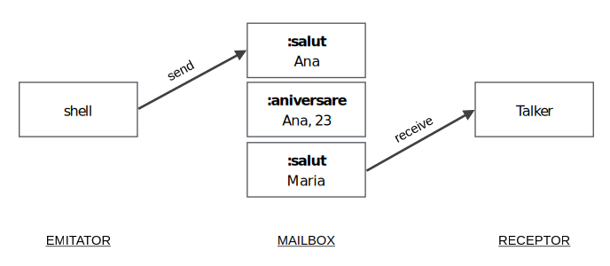
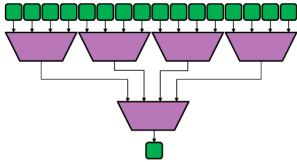
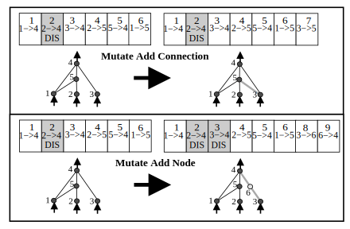
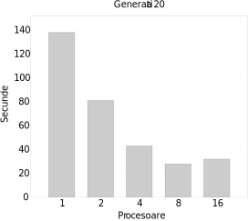

layout: true
name: inverse
class: center, middle, inverse

---
name: first
layout: false
class: center, middle
count: false

# Actori in Elixir
## Ștefan Niculae, Andreea-Daniela Ene

.bottom[
31 mai 2017 | Proiect ICLP
]

---
name: agenda
layout: false
class: center
count: false

# Agenda
1. Actori
2. Elixir
3. Exemple practice
4. Studiu de caz


---
template: inverse
count: false

# .section-number[I.] Actori

---
layout: true
name: actors

## Actori

---
template: actors
class: iterative-header-slide

## model computational

.footnote[sursa: [interviu Hewitt, Meijer and Szyperski](https://www.youtube.com/watch?v=1zVdhDx7Tbs)]

<def>Actor</def> unitatea fundamentala de computatie.

--

Laturi esentiale:

- procesare
- stocare
- comunicare

---
template: actors
class: iterative-header-slide

## model computational

Fiecare actor are o _adresa_ si un _mailbox_.

--

Un actor poate trimite mesaje altuia. Cand isi trimite siesi se numeste recursie.

--

Cand un actor primeste un mesaj, el poate:

- creea alti actori
- trimite mesaje actorilor cunoscuti
- defini ce face cu urmatorul mesaj


---
class: iterative-header-slide

## model computational

- Programare functionala: evita stare mutabila.

  Programare cu actori: mentine stare mutabila dar nu o partajeaza.

--

- Opus unui model *state-machine*, intr-o configuratie, un mesaj *se duce*, nu ajunge instant la destinatar.

  Mai fidel unui model fizic decat unuia algebric.

--

- Modelul Turing: *nedeterminism bounded*.

  Modelul cu Actori: *indeterminism unbounded* — un request poate lua oricat timp sa ajunga la server, *arbitrul* sa il aleaga si sa se intoarca raspunsul.

---
class: iterative-header-slide

## model computational

Mesajele sunt trimise direct, nu printr-un canal, eliminand overhead-ul.

--

Nu este garantata pastrarea ordinii trimiterii mesajelor la primire.

--

Sincronicitatea este data de faptul ca mesajele sunt procesate cate unul.

---
class: iterative-header-slide

## in Elixir

<def>Actor</def> process

--

<def>Adresa</def> PID (process identifier)

--

<def>Mesaj</def> tuplu  `{:set, "Popescu", 500}`

--

<def>Mailbox</def> coada


---
template: inverse
count: false

# .section-number[II.] Elixir

---
layout: true
name: elixir

## Elixir

---
template: elixir
class: iterative-header-slide

## despre limbaj

- aparut in 2011

--
- construit peste Erlang
  - compileaza in bytecode pt Erlang Virtual Machine (BEAM)

--
- limbaj functional
  - functii ca first class citizen
  - accent pe recursie si higher-order functions
  - variabile imutabile

--
- tipuri dinamice (inferenta la runtime)
- orientat-proces

--
- lightweight concurrency
- message passing

--
- gandit pt scalare — tolerant la erori

--
- utilizator important: _Pinterest_

---
class: iterative-header-slide

## sintaxa

- expresiile sunt delimitate de newline sau `;`
- comentariile incep cu `#`
- blocurile incep cu `do` si se termina cu `end`


---
class: iterative-header-slide

## tipuri

.footnote[sursa: [documentatie Elixir](https://elixir-lang.org/getting-started/introduction.html)]

```elixir
5            # int
2.0          # float
true         # boolean
:symb        # atom
"str"        # string
["a", 1, 2]  # lista
{:a, 5.2}    # tuplu
nil          # valoare nula
~r/[a-z]/i   # regex
```
--
```elixir
# keyword list
> dict = [cheie: "valoare", secret: 123]  # cheia trebuie sa fie atom
> dict[:secret]
123
```
--
```elixir
# map
> map = %{"a" => true, 102 => false}  # cheia poate fi orice tip
> map[102]
false
```

---
class: iterative-header-slide

## operatori

```elixir
# aritmetici
> 1 + 2
3
> 7 / 2
3.5  # mereu float, pt trunchiere, exista functiile div si rem
```
--
```elixir
# comparare
> 0 <= 1
true
> 0 == 1
false
```
--
```elixir
# logici
> true or 0/0 == 0  # scurtcircuitare
true
```

---
class: iterative-header-slide

## operatori

```elixir
# pe string-uri
> "abc #{:def}"  # interpolare
"abc def"
> "he" <> "llo"
"hello"
> "Hello" =~ ~r/[a-z]/i  # regex match
true
```
--
```elixir
# pe liste
> [1, 2] ++ [3]
[1, 2, 3]
> [1, 2, 3] -- [2]
[1, 3]
```

---
class: iterative-header-slide

## variabile

Incep cu litera mica, pot contine litere mici/mari se pot termina in `?` sau `!`.

--

```elixir
# refolosire
> var = 2
2
> var = 3
3
```

--

(conventii) nume in `snake_case`; underscore `_` pt variable nefolosite.

???
_ ca in Haskell/altele

---
class: iterative-header-slide

## pattern matching

Operatorul `=`

```elixir
> x = 1
1
> x
1
```
--
```elixir
# variabile
> 1 = x  # x match-uieste cu patternul "1", ok
> 2 = x  # x nu match-uieste cu patternul "2", eroare
MatchError
```
--
```elixir
# tupluri
> {a, b, c} = {:hello, "world", 24}
> a
:hello
> b
"world"

> {a, b, c} = {:hello, "world"}
MatchError
```

---
class: iterative-header-slide

## pattern matching

Operatorul `=`

```elixir
# liste
> [a, b, c] = [1, 2, 3]
> a
1
```
--
```elixir
> [head | tail] = [1, 2, 3]
> head
1
```

---
class: iterative-header-slide

## pattern matching

Operatorul pin `^`

```elixir
> x = 1
> ^x = 2
MatchError
```
--
```elixir
> {y, ^x} = {2, 1}  # transformat in {y, 1} = {2, 1}
> y
2
> {y, ^x} = {2, 2}  # transformat in {y, 1} = {2, 2}
MatchError
```
--
`^x` in loc sa ii lege `x` valoarea din partea dreapta, foloseste valoarea existenta a lui `x` pt a face matching.

---
class: iterative-header-slide

## branching

```elixir
# case
case {1, 2, 3} do
  {1, x, 3} when x > 0 -> "match-uieste"
   _                   -> "otherwise"
end
```
--
```elixir
# functie anonima
f = fn
  x, y when x > 0 -> x + y
  x, y            -> x * y
end
```
--
```elixir
# cond (similar cu mai multe if/else if)
cond do
  0 == 1 -> "nu match-uieste"
  5 < 77 -> "aici da"
end
```

???
in Haskell: case .. of ..

---
class: iterative-header-slide

## branching

```elixir
# if
if nil do
  "niciodata"
else
  "aici"
end
```
--
```elixir
# ca functie
if true, do: 5, else: :altceva
```

---
class: iterative-header-slide

## functii

Identificate dupa nume si aritate, grupate intr-un modul.

Modulele incep cu litera mare, nu trebuie sa coincida cu numele fisierului.

--

```elixir
defmodule Modul do
  def sum(a, b) do
    a + b
  end

  defp privat(x \\ "default") do  # functie privata, argument implicit
    x <> "!"
  end

  def zero?(0), do: true  # pattern matching, keyword list form
  def zero?(x) when is_integer(x), do: false  # guard
end
```
--
```elixir
> Modul.sum(2, 3)    #=> 5
> Modul.privat("a")  #=> UndefinedFunctionError - inaccesibil
```
--
```elixir
# functie anonima
> f = &(&1 * &2)     # &1 este primul argument
> f.(2, 3)           #=> 6
```

---
class: iterative-header-slide

## enumerabile

```elixir
# list comprehension, in Haskell: [n^2 | n <- [1..5], odd n]
> for n <- [1, 2, 3, 4, 5], rem(n, 2) == 1, do: n*n
[1, 9, 25]
```
--
```elixir
> odd? = &(rem(&1, 2) != 0)
# range .., pipe |>, higher order functions
> 1..100_000 |> Enum.map(&(&1 * 3)) |> Enum.filter(odd?) |> Enum.sum
7500000000
```
Functiile din modulul `Enum` sunt eager. Modulul `Stream` are echivalentele lor in varianta lazy.

Apelarea unei functii dintr-un modul se face prin capturare: `Enum.map(list, &Funcs.double/1)`.

--

```elixir
# numerele pitagoreice, ie: {a, b, c} aî a^2 + b^2 = c^2
def pythagorean(n) when n > 0 do
  # list comprehension
  for a <- 1..n,  # produs cartezian [1..n]^3
      b <- 1..n,
      c <- 1..n,
      a + b + c <= n,  # doua filtre
      a*a + b*b == c*c,
      do: {a, b, c}
end
```
???
Lazy ca in Haskell

---
class: iterative-header-slide

## procese

Memorie izolata, ruleaza concurent, comunica prin mesaje.

--

Foarte lightweight — consuma putine resurse si au timp de pornire mic (mai usoare decat thread-urile din alte limbaje).

???
Lightweight ca in Erlang

--
```elixir
> pid = spawn fn -> 1 + 2 end  # proces ruleaza o functie
PID<0.100.0>  # returneaza pid-ul

> Process.alive?(pid)
false  # a terminat deja de rulat 1 + 2
```

---
class: iterative-header-slide

## procese

```elixir
> send self, {:hello, "fmi"}  # trimite un mesaj siesi
> send self, {:hello, "ub"}   # pune in continuare in mailbox
```
--
```elixir
> receive do  # citeste primul mesaj din mailbox
    {:hello, name} -> "salut, #{name}"
    {:bye,   name} -> "nu match-uieste"
  after
    3_000 -> "nimic dupa 3s"
  end
"salut, fmi"
```
--
```elixir
> flush  # goleste mailbox-ul si printeaza mesajele
{:hello, "ub"}
:ok
```

???
functia `send` in loc de `Pid ! Message` din Erlang

---
class: iterative-header-slide

## procese

Este in regula ca procesele sa esueze.

Ne asteptam ca supervizorii sa se ocupe de restartarea lor.

--

Legam un supervizor prin primitiva `spawn_link/0`.

--

```elixir
# ii setam procesului ca supervizor shell-ul
> spawn_link fn -> raise "eroare" end
PID<0.77.0>
RuntimeError eroare (from PID<0.77.0>)
```

???
similar cu `link` si monitoarele din Erlang

---
class: iterative-header-slide
exclude: true

## stare

Un proces care ruleaza permanent cu `loop`.

*Starea* este un dictionar pasat prin argumente.

Operatiile de citire/scriere sunt tratate de mesaje ce incep cu `:get` / `:set`.

--
exclude: true

```elixir
# kv.exs
defmodule KV do  # KeyValue
  @doc "dictionar cheie-valoare"

  def start_link do
    start_link(fn -> loop(%{}) end) # incepem cu un dictionar gol
  end

  defp loop(map) do
    receive do
      {:get, key, caller} ->
        send caller, Map.get(map, key)  # raspundem apelantului
        loop(map)                       # continuam sa asteptam mesaje
      {:put, key, value} ->
        loop(Map.put(map, key, value))  # actualizam modificand argumentul
    end
  end
end
```

---
class: iterative-header-slide
exclude: true

## stare

```elixir
$ ies kv.exs  # executam interactiv, similar cu ghci
> {:ok, pid} = KV.start_link

> send pid, {:get, :inexistent, self}
> flush
nil  # cheia nu a existat in dictionar

> send pid, {:put, :cheie, "valoare"}
> send pid, {:get, :cheie, self}
> flush
"valoare"  # ce am pus anterior la :cheie

> Process.register(pid, :kv)  # putem numi procesul
> send :kv, {:put, :cheie, "valoare"}  # nu mai este nevoie sa stim pid-ul
```

--
exclude: true

**Agent** = abstractie pentru stare.

---
class: iterative-header-slide

## structuri

```elixir
defmodule User do  # numele structurii
  defstruct nume: "Ana", ani: 23  # valori implicite
end
```
--
```elixir
> %User{}  # valorile implicite
%User{nume: "Ana", ani: 23}
> %User{nume: "Bogdan"}
%User{nume: "Bogdan", ani: 23}
```
--
```elixir
> %User{inexistent: 7}
KeyError
```
--
```elixir
> cristi = %User{nume: "Cristi", ani: 40}
> cristi.name  # accesare
"Cristi"
> dan = %{cristi | nume: "dan"}  # actualizare (copiere din cauza imutabilitatii)
%User{nume: "Dan", ani: 40}
```

---
class: iterative-header-slide

## structuri

```elixir
defmodule Struct do
  @enforce_keys [:obligatorie]  # atribut
  defstruct [:obligatorie, :optionala]
end
```
--
```elixir
> %Struct{}  # nu am pus argumentul obligatoriu
ArgumentError :obligatorie must be given
```
--
```elixir
> %Struct{obligatorie: 5}  # valoare implicita pt un argument optional este nil
%Struct{obligatorie: 5, optionala: nil}
```

---
class: iterative-header-slide

## protocoale

Mecanism de polimorfism.


```elixir
defprotocol Mergator do
  def nr_picioare(data)
```
--
```elixir
defimpl Mergator, for: Pers do
  def nr_picioare(pers), do: 2
```
--
```elixir
defimpl Mergator, for: Catel do
  # nr_picioare neimplementat, vom primi warning
```
--
```elixir
defimpl Mergator, for: Any do
  def nr_picioare(_), do: 0  # implicit, zero picioare
```
--
```elixir
defmodule Sarpe do
  @derive[Mergator]  # fallback, ii este suficienta implementarea cu zero
  defstruct [:nume, :lungime]
```

---
class: iterative-header-slide

## protocoale

```elixir
> pers  = %Pers{ani: 23, nume: "Ana"}
> catel = %Catel{cuminte: true, nume: "Rex"}
> sarpe = %Sarpe{lungime: nil, nume: nil}
```
--
```elixir
> Mergator.nr_picioare(pers)   # => 2
> Mergator.nr_picioare(catel)  # => UndefinedFunctionError
> Mergator.nr_picioare(sarpe)  # => 0
```
--
`Enum` functioneaza pe orice implementeaza protocolul `Enumerable`.

--

Se pot defini implementari pt tipurile implicite: `Tuple`, `Map` etc.

---
class: iterative-header-slide

## erori

Trei mecanisme de eroare:

- `error` — situatii exceptionale
- `throw` — controlul executiei
- `exit`  — terminare proces

--

`try/catch` si `try/rescue` nu sunt foarte comune. In loc de recuperarea unei erori, preferam sa "esuam rapid" — arborele de supervizare se va ocupa de redresare.

--

```elixir
> :foo + 1       # adunare atom cu numar
ArithmeticError  # eroare, sau exceptie
```
--
```elixir
> raise "oops"   # invocare exceptie manual
RuntimeError oops
```

---
class: iterative-header-slide

## erori

```elixir
> defmodule Eroare do  # tip custom de eroare
    defexception message: "mesaj implicit"
  end
> raise Eroare
Eroare mesaj implicit
```
--
```elixir
> try do
    raise "oops"
  rescue
    RuntimeError -> "eroare!"
 end
"eroare!"
```
--
```elixir
> case File.read "date.txt" do
    {:ok, continut} -> IO.puts "Success: #{continut}"
    {:error, motiv} -> IO.puts "Eroare: #{motiv}"
  end
Eroare: enoent  # no entry
```
--
```elixir
> File.read! "sigur-exista.txt"  # cand lipsa fisierului este o eraore
File.Error
```

---
class: iterative-header-slide

## erori

```elixir
> try do
    Enum.each -50..50, fn(x) ->
       if rem(x, 13) == 0, do: throw(x)
    end
  catch
     x -> "am prins #{x}"
   after  # optional
     IO.puts "executat indiferent de erori"
  end
"executat indiferent de erori"
"am prins -39"

> exit :normal
```
--
In interiorul unei functii, corpul este automat imbracat intr-un `try` daca exista `after`, `rescue` sau `catch`.

---
class: iterative-header-slide

## typespec

Declararea tipurilor in semnaturile functiilor si definirea tipurilor custom.

Definim un calculator ce intoarce pe langa rezultatul calculului si un comentariu.

???
Similar cu `type`/`newtype` din Haskell

--

```elixir
defmodule CalculatorObraznic do
  # definim un tip nou
  @typedoc "Numar urmat de un string"
  @type nr_cu_comentariu :: {number, String.t}
```
--
```elixir
  # specificam tipurile argumentelor si cel de intoarcere
  @spec add(number, number) :: nr_cu_comentariu
  def add(a, b), do: {a + b, "pt asta aveai nevoie de calculator?"}
```
--
```elixir
  @spec multiply(number, number) :: nr_cu_comentariu
  def mul(a, b), do: {a * b, "puteai folosi adunarea pt asta..."}
end
```

---
class: iterative-header-slide

## topici avansate

Atribute:

- constante statice ale structurilor
- documentatie

--

Meta programare:

- `macro` — extindere limbaj, permite manipularea directa a AST
- `DSL` (Domain Specific Language) — implementare API pt un caz aparte


---
template: inverse
count: false

# .section-number[III.] Exemple practice
### din Seven Concurrency Models in Seven Weeks

---
layout: true
name: basics

## Basics

---
template: basics
class: iterative-header-slide

## mesaje si mailbox

Mesajele sunt trimise asincron. Fiecare actor are un *mailbox* in care se aduna de mesajele primite, de procesat.

Actorii rulează în acelaşi timp, dar sunt prelucraţi secvenţial.

--

```elixir
defmodule Talker do
  def loop do
    receive do  # asteptare
      {:salut, name}           -> IO.puts "Bună, #{name}"
      {:aniversare, name, age} -> IO.puts "#{name} a împlinit #{age} ani"
      {:shutdown} -> exit :normal  # oprire proces
    end
    loop
  end
end
```
--
```elixir
receive do
  # detectia opririi procesului
  {:EXIT, ^pid, reason} -> IO.puts "Talker has exited, #{reason}"
end
```

---
class: iterative-header-slide

## mesaje si mailbox

```elixir
> Process.flag(:trap_exit, true)
> pid = spawn &Talker.loop/0           # pornire proces
```
--
```elixir
# trimitere mesaje
> send pid, {:salut, "Ana"}           # Bună, Ana
> send pid, {:aniversare, "Ana", 23}  # Ana a implinit 23 ani
> send pid, {:salut, "Maria"}         # Bună, Maria
> send pid, {:shutdown}               # Talker has exited, normal
```

Pattern matching pe structura si continutul mesajului trimis

---
class: iterative-header-slide

## mesaje si mailbox



---
class: iterative-header-slide

## stare

Mentinem starea prin argumente si tail recursion.

--

```elixir
defmodule Counter do
  def loop(count) do
    receive do
      {:next} ->
        IO.puts "Număr curent: #{count}"
        loop(count + 1)
    end
   end
end
```
--
```elixir
> counter = spawn Counter, :loop, [1] # modul, functie, argument(e)
> send counter, {:next}               # Număr curent: 1
> send counter, {:next}               # Număr curent: 2
```

Pastrare stare intre apeluri

---
class: iterative-header-slide

## API

`Process.register(pid, :atom)` face cunoscut un `pid` ca un `:atom` global, pentru a putea ii putea trimite alte procese mesaje doar prin `:atom`.

--

Imbracam functionaliteatea intr-un API: `start/1` si `next/0`.

--

```elixir
defmodule Counter do
  def start(k) do
    pid = spawn __MODULE__, :loop, [k]  # __MODULE__ expandeaza in Counter
    Process.register pid, :counter      # numim actorul :counter
  end
```
--
```elixir
  def next do
    ref = make_ref()                    # creeaza o referinta unica
    send :counter, {:next, self, ref}   # trimite lui :counter semnalul :next
    receive do
      {:ok, ^ref, count} -> count       # primim inapoi count-ul curent
    end
  end
```

---
class: iterative-header-slide

## API

```elixir
  def loop(count) do
    receive do
      {:next, sender, ref} ->           # asteapta sa vina un mesaj cu tipul :next
        send sender, {:ok, ref, count}  # ii trimitem inapoi count-ul curent
        loop(count + 1)                 # incrementeaza count pt urmatorul apel
    end
  end
end  # Counter
```
--
```elixir
> Counter.start(24)
> Counter.next  # 24
> Counter.next  # 25
```

Pastrare stare intre apeluri

---
class: iterative-header-slide

## map paralel

Pornim un proces pt fiecare element.

--

```elixir
defmodule Parallel do
  def map(collection, fun) do
    parent = self  # cui vor trimite workerii inapoi

    # crează câte un proces pentru fiecare element din colecţie
    processes = Enum.map collection, fn(e) ->
        spawn_link fn ->
            send parent, {self, fun.(e)}
          end
      end
```
--
```elixir
    # aşteaptă fiecare rezultat
    Enum.map processes, fn(pid) ->
        receive do
          {^pid, result} -> result
        end
      end
  end
end
```

---
class: iterative-header-slide

## map paralel

```elixir
slow_double = fn(x) -> :timer.sleep(1000); x * 2 end
```
--
```elixir
> Enum.map     [1, 2, 3, 4], slow_double  # 4s
```
--
```elixir
> Parallel.map [1, 2, 3, 4], slow_double  # 1s
```

Patru procese ruleaza simultan.

---
class: iterative-header-slide

## reduce paralel

Pornim cate un proces pt fiecare operatie de reducere, injumatatind de fiecare data lista de procesat — paralelism logaritmic.



```elixir
def reduce(collection, fun) do
  len = length collection
  if len == 1 do
    # un singur element, il intoarcem
    Enum.at collection, 0
```

---
class: iterative-header-slide

## reduce paralel

```elixir
  else
    parent = self  # cui vor trimite workerii inapoi
    {left_half, right_half} = Enum.split collection, round(len/2)

    # asigneaza treaba worker-ilor pt jumatatea stanga si dreapta
    processes = Enum.map [left_half, right_half], fn(half) ->
      spawn_link fn ->
        result = Parallel.reduce half, fun  # aplica recursie
        send parent, {self, result}
      end
    end
```
--
```elixir
    # asteapta rezultatele
    [left_result, right_result] = Enum.map processes, fn(process) ->
      receive do
        {^process, result} -> result
      end
    end
```
--
```elixir
    # reduce cele doua rezultate intr-unul
    fun.(left_result, right_result)
  end
end  # reduce/2
```

---
class: iterative-header-slide

## reduce paralel

```elixir
slow_add = fn(a, b) -> :timer.sleep(1000); a + b end  # trebuie sa fie asociativ
```
--

```elixir
> Enum.reduce     [1, 2, 3, 4, 5, 6], slow_add  # 5s
```

Secvential - 5 timpi operatii: `1+2`, `(1+2)+3`, `... +4`, `... +5`, `... +6`

--

```elixir
> Parallel.reduce [1, 2, 3, 4, 5, 6], slow_add  # 3s
```

Paralel - log(5) = 3 timpi operatii:
1. `1+2`, `4+5`
2. `(1+2)+3`, `(4+5)+6`
3. `[(1+2)+3] + [(4+5)+6]`


---
template: inverse
count: false

# Toleranta la defecte

---
layout: true
name: fault-tolerance

## Fault tolerance

---
template: fault-tolerance
class: iterative-header-slide

## cache

Modul care cache-uieste pagini web:

- `put` trimitem un url impreuna cu continutul paginii pentru stocare
- `get` consultam cache-ul pt un url
- `size` verificam dimensiunea cache-ului

--

```elixir
def put(url, page) do
  send :cache, {:put, url, page}  # doar trimite mai departe argumentele
```
--
```elixir
def get(url) do
  ref = make_ref()  # referinta unica, pt a putea fi identificat in receive
  send :cache, {:get, self, ref, url}  # trimite argumentele
  receive do
    {:ok, ^ref, page} -> page  # primeste si raspunsul
  end
```
--
```elixir
def size do
  ref = make_ref()
  send :cache, {:size, self, ref}
  receive do
    {:ok, ^ref, s} -> s
  end
```

---
class: iterative-header-slide

## cache

```elixir
def loop(pages, size) do
  receive do
    {:put, url, page} ->
      new_pages = Map.put pages, url, page  # pune pagina in dictionar
      new_size = size + byte_size page      # actualizeaza dimensiunea
      loop new_pages, new_size              # pregateste starea pt un nou mesaj
```
--
```elixir
    {:get, sender, ref, url} ->
      send sender, {:ok, ref, pages[url]}  # trimite pagina de la adresa ceruta
      loop pages, size                     # starea ramane aceeasi pt urmatorul mesaj
```
--
```elixir
    {:size, sender, ref} ->
      send sender, {:ok, ref, size}        # analog cu :get
      loop pages, size
  end
end
```

---
class: iterative-header-slide

## cache

Folosire normala:

```elixir
> Cache.put "google.com", "Search the Web"  #=> {:put, "google.com", "Search the Web"}
> Cache.get "google.com"                    #=> "Search the Web"
> Cache.size                                #=> 14
> Cache.get "unibuc.ro"                     #=> nil - nu am pus nimic la adresa asta
```

--

Folosire anormala:

```elixir
> Cache.put "unibuc.ro", nil  # al doilea argument ar trebui sa fie string
EXIT from PID<...>
  ArgumentError
```

--

Nu am scris niciun cod pt verificarea argumentelor.

--

Separam tratarea erorilor intr-un proces separat, **supervizor**.

---
class: iterative-header-slide

## supervizare

Despre legare:

- Doua procese pot fi legate prin `Process.link(pid_other)`.

--

- Cand oricare se termina neasteptat, ambele se opresc.

--

- Cand unul dintre ele se termina normal (`exit :normal`), procesul legat nu se incheie.

--

- Prin `Process.flag(:trap_exit true)`, la terminare anormala, procesul legat va fi doar notificat.

---
class: iterative-header-slide

## supervizare

Adaugam la `Cache` comanda de terminare normala:


```elixir
defmodule Cache do
  def start_link do
    pid = spawn_link(__MODULE__, :loop, [Map.new, 0])  # dictionar gol, dimensiune zero
    Process.register pid, :cache
    pid
  end
```
--
```elixir
  # ... put/2, get/1 size/0 ...
```
--
```elixir
  def terminate do
    send :cache, {:terminate}
  end
```
--
```elixir
  def loop(pages, size) do
    receive do
      # ... :put, :get, :size ...
      {:terminate} -> exit :normal
    end
  end
end
```

---
class: iterative-header-slide

## supervizare

Definim un supervizor care reporneste actorul `Cache` in caz de esuare:

--

```elixir
defmodule CacheSupervisor do
  def start do
    spawn(__MODULE__, :loop_system, [])  # niciun argument initial
```
--

```elixir
  def loop_system do
    Process.flag :trap_exit, true  # setam flag-ul de supervizare
    loop  # gata de primit mesaje
```

--

```elixir
  def loop do
    pid = Cache.start_link  # porneste actorul Cache
    receive do
      {:EXIT, ^pid, :normal} ->
        IO.puts "cache s-a terminal normal - inchidere"
        :ok  # oprim si supervizorul
```
--
```elixir
      {:EXIT, ^pid, reason} ->  # terminare anormala
        IO.puts "cache a esuat cu motivul #{inspect reason} - repornim"
        loop  # va reporni Cache
```
---

class: iterative-header-slide
exclude: true

## supervizare

Caz special:

1. procesul A trimite mesaj `:put` cache-ului
2. procesul B trimite mesaj `:get` cache-ului
3. Cache-ul crash-uieste la procesarea mesajului A
4. Supervizoul reporneste cache-ul dar mesajul B este pierdut
5. Procesul B este in deadlock — asteapta un raspuns care nu va ajunge niciodata

--
exclude: true

Solutie — adaugam un timeout la metodele `get` si `size`:

```elixir
def get(url) do
  ref = make_ref()
  send(:cache, {:get, self, ref, url})
  receive do
    {:ok, ^ref, page} -> page
    after 1000        -> nil  # timeout
end
```

---
class: iterative-header-slide

## error kernel

> Există doua moduri de face designul unui software,
> il poti face atat de simplu incat sa fie evident ca nu exista greseli,
> sau il poti face atat de complicat incat sa nu existe greseli evidente.
> — Tony Hoare

--

<def>Error kernel</def>partea care trebuie sa fie corecta pt ca intregul sistem sa functioneze corect.

--

Ideal cat mai mic si simplu cu putinta — astfel incat sa fie evident ca nu exista greseli.

--

Ierarhie de error-kernel-uri implementata prin supervizori in Elixir.

---
class: iterative-header-slide

## error kernel

Vrem o metoda care verifica daca un string contine doar majuscule:

--

```elixir
def all_upper?(s) do
  String.upcase(s) == s
end
```

--

Ce facem in caz ca pasam ca argument `nil`?

--

Intr-un stil de *programare defensiva*:

```elixir
def all_upper?(s) do
  cond do
    nil?(s) -> false
    true    -> String.upcase(s) == s
  end
end
```

--

Acum tratam si cazul `nil`.


---
class: iterative-header-slide

## error kernel

Dar daca pasam un atom?

--

Putem adauga inca o clauza insa probabil codul care a apelat astfel are un bug si in felul asta noi l‑am mascat.

--

In programarea cu actori, imbratisam mentalitatea _"let it crash"_, lasand supervizorul sa adreseze problema.

--

 Beneficii:

* codul este mai simplu si usor de inteles, separare intre functionarea normala si cea toleranta

--

* actorii sunt separati si nu impart aceeasi stare, prabusirea unuia neafectand alti actori

--

* pe langa rezolvarea erorii, supervizorul le poate si loga, dezvaluind bug-uri


---
template: inverse
count: false

# Scalare

---
layout: true
name: scaling

## Scalare

---
template: scaling
class: iterative-header-slide

## OTP

Biblioteca `OTP` (din Erlang) pune la dispozitie `GenServer` — un `behaviour` care automatizeaza crearea unui actor stateful.

`Cache` reimplementat conform `GenServer`:

```elixir
defmodule Cache do
  use GenServer.Behaviour

  # adauga pagina la adresa data
  def handle_cast({:put, url, page}, {pages, size}) do
    new_pages = Dict.put(pages, url, page)
    new_size = size + byte_size(page)
    {:noreply, {new_pages, new_size}}

  # trimite pagina de la adresa data
  def handle_call({:get, url}, _from, {pages, size}) do
    {:reply, pages[url], {pages, size}}

  # trimite dimensiunea
  def handle_call({:size}, _from, {pages, size}) do
    {:reply, size, {pages, size}}
```

---
class: iterative-header-slide

## OTP

API public:
```elixir
  def start_link do
    :gen_server.start_link({:local, :cache}, __MODULE__, {Map.new, 0}, [])

  # adauga pagina
  def put(url, page) do
    :gen_server.cast(:cache, {:put, url, page})

  # trimite pagina
  def get(url) do
    :gen_server.call(:cache, {:get, url})

  # trimite dimensiune
  def size do
    :gen_server.call(:cache, {:size})
```

---
class: iterative-header-slide

## conectare noduri

<def>Nod</def> masina

--

Pentru ca două noduri să se poată conecta, ambele trebuie denumite (--sname).

--

Pentru o conexiune, securitatea minima este un --cookie partajat.

--

- `Node.self`:  afla numele nodului
- `Node.list`: numele nodurilor conectate

```elixir
machine-1 $ iex --sname nod1 --cookie yumyum
(nod1)> Node.self #=> :nod1
(nod1)> Node.list #=> [] - niciun alt nod conectat
```
--

```elixir
machine-2 $ iex --sname nod2 --cookie yumyum
(nod2)> Node.self #=> :nod2
```

---
class: iterative-header-slide

## conectare noduri

`Node.connect` efectueaza o conexiune cu un alt nod:

```elixir
(nod1)> Node.connect(:nod2)
(nod1)> Node.list  # [:nod2]
```

--

`Node.spawn` porneste un thread pe alt nod si redirecteaza output-ul pe nodul host:

```elixir
(nod1)> whoami = fn-> IO.puts(Node.self) end
(nod1)> Node.spawn :nod2, whoami
PID<...> nod2  - output din nodul conectat
```

--

Conexiunile sunt bidirectionale:

```elixir
(nod2)> Node.list  #=> [:nod1]
```

---
class: iterative-header-slide

## conectare noduri


Inregistrare procese pe retea:

```elixir
(nod2)> pid = spawn Counter, :loop, [24]
(nod2)> :global.register_name :counter, pid
```

--

Aflare adresa de pe retea si trimitere mesaje distribuit:

```elixir
(nod1)> pid = :global.whereis_name :counter  #=> PID<...> nod2
(nod1)> send pid, :next  # Număr curent: 24
(nod1)> send pid, :next  # Număr curent: 25
```

---
class: iterative-header-slide

## word counter

Sistem ce numara de cate ori apar cuvintele pe paginile Wikipedia.

--

- va functiona pe mai multe core-uri
- poate scala pe mai mult de o masina
- redresare in caz de esec

---
class: iterative-header-slide

## word counter

Actori:
- un `Parser`: furnizeaza pagini dintr-un dump Wikipedia

--
- mai multi `Counter`: numara cuvintele dintr-o pagina

--
- un `Accumulator`: tine minte totalul cuvintelor pt toate paginile

--


Pasi procesare:
1. un `Counter` cere o pagina de la `Parser`

--
2. `Counter`-ul numara cuvintele din pagina si le trimite la `Accumulator`

--
3. `Accumulator`-ul transmite `Parser`-ului ca pagina a fost procesata

---
class: iterative-header-slide

## word counter


---
layout: false
## Counter

```elixir
defmodule Counter do
  use GenServer.Behaviour
```
--
```elixir
  # API public
  def start_link do
    :gen_server.start_link(__MODULE__, nil, [])  # nimic ca stare
  end
  def deliver_page(pid, ref, page) do  # semnal pt a incepe numararea paginilor
    :gen_server.cast pid, {:deliver_page, ref, page}
  end
```
--
```elixir
  # initializare
  def init(_args) do
*    Parser.request_page(self)
    {:ok, nil}
  end
```

Pornim prin a cere o pagina de la `Parser`

---
## Counter

La primirea unei pagini:
1. cere o pagina noua (inainte de procesare pt minimizarea latentei)

--
2. numara cuvintele din pagina construind dictionarul `counts`

--
3. trimite dictionarul catre `Accumulator` impreuna cu `ref`-ul paginii


--

```elixir
  # implementare
  def handle_cast({:deliver_page, ref, page}, state) do
*   Parser.request_page(self)  # pas 1

    words = String.split(page)
    counts = Enum.reduce words, Map.new, fn(word, counts) ->
*       Dict.update(counts, word, 1, &(&1 + 1))  # pas 2
      end
*   Accumulator.deliver_counts(ref, counts)  # pas 3
    {:noreply, state}
  end

end  # Counter
```

---
## Counter

Un supervizor restarteaza `Counter` in caz de esec

```elixir
defmodule CounterSupervisor do
  use Supervisor.Behaviour

  def start_link(num_counters) do
    :supervisor.start_link(__MODULE__, num_counters)
  end

  def init(num_counters) do

    # instantiem workeri
    workers = Enum.map 1..num_counters, fn(n) ->
      worker(Counter, [], id: "counter#{n}")
    end

    # :one_for_one - cand esueaza un proces il repornim
    # :one_for_all - cand esueaza un proces le repornim pe toate
*   supervise workers, strategy: :one_for_one
  end
end
```

---
## Accumulator

Elemente stare:
- `totals`: dictionar continand numarul total de aparitii
- `processed_pages`: multime continand referintele paginilor procesate

--

```elixir
defmodule Accumulator do
  use GenServer.Behaviour

  # API public

  def start_link do
    :gen_server.start_link({:global, :wc_accumulator}, __MODULE__,
      {Map.new, HashSet.new}, [])  # initial, niciun cuvant numarat si nicio pagina procesata
  end

  # primeste pagina (identificata de ref) impreuna cu dictionarul de aparitii
  def deliver_counts(ref, counts) do
    :gen_server.cast {:global, :wc_accumulator}, {:deliver_counts, ref, counts}
  end
```

---
## Accumulator


La primirea unui dictionar de aparitii `counts`:
1. verifica sa nu fi procesat deja pagina identificata de `ref`

--
2. aduna aparitiile din dictionar `count` la cele cunoscute `totals`

--
3. marcheaza pagina identif. de `ref` ca procesata

--
4. notifica parserul ca pagina identif. de `ref` a fost procesata

--

```elixir
def handle_cast({:deliver_counts, ref, counts}, {totals, processed_pages}) do
* if Set.member? processed_pages, ref do  # pas 1
    {:noreply, {totals, processed_pages}}  # nu schimba nimic
```
--
```elixir
  else
*   new_totals = Dict.merge(totals, counts, fn(_k, v1, v2) -> v1 + v2 end)  # pas 2
*   new_processed_pages = Set.put processed_pages, ref  # pas 3
*   Parser.processed ref  # pas 4
    {:noreply, {new_totals, new_processed_pages}}
  end
end
```

---
## Parser

```elixir
defmodule Parser do
  use GenServer.Behaviour

  # API public

  def start_link(filename) do
    :gen_server.start_link({:global, :wc_parser}, __MODULE__, filename, [])
  end

  # apelat de Counter cand cere o pagina
  def request_page(pid) do
    :gen_server.cast {:global, :wc_parser}, {:request_page, pid}
  end

  # apelat de Accumulator cand a procesat o pagina
  def processed(ref) do
    :gen_server.cast {:global, :wc_parser}, {:processed, ref}
  end
```

---
## Parser

Elemente stare:
- `pending`: referinte ale paginilor trimise unui `Counter` dar neprocesate inca
- `xml_parser`: parser din biblioteca Erlang pt dump-ul Wikipedia

--

```elixir
# initializare
def init(filename) do
  xml_parser = Pages.start_link(filename)
  {:ok, {ListDict.new, xml_parser}}  # initial, nicio pagina nu este pending
end

# trimite pagina catre Counter si actualizeaza lista pending
def handle_cast({:request_page, pid}, {pending, xml_parser}) do
  new_pending = deliver_page(pid, pending, Pages.next(xml_parser))
  {:noreply, {new_pending, xml_parser}}
end

# sterge pagina din lista de pending
def handle_cast({:processed, ref}, {pending, xml_parser}) do
  new_pending = Dict.delete pending, ref
  {:noreply, {new_pending, xml_parser}}
end
```

---
## Parser

Trimite pagina catre `Counter` si inregistreaz-o in `pending`:

```elixir
defp deliver_page(pid, pending, page) do
  ref = make_ref()
*  Counter.deliver_page pid, ref, page
  Dict.put pending, ref, page
end
```

--

Daca `page` este `nil` inseamna ca am terminat de parcurs dump-ul:

ia cel mai veche `ref` din `pending` si trimite-l catre `Counter`

```elixir
defp deliver_page(pid, pending, page) when nil?(page) do
  if Enum.empty?(pending) do
    pending  # gata: parsat toate paginile si trimis toate pending
  else
    {ref, prev_page} = List.last pending
*    Counter.deliver_page pid, ref, prev_page
    Dict.put(Dict.delete(pending, ref), ref, prev_page)
  end
end
```

---
## Avantajul

Cand am terminat de parsat, de ce retrimitem pagini ramase `pending`?

--

Inseamna ca mesajul cu pagina nu a ajuns la `Counter`, sau ca mesajul acestuia nu s-a intors.

--

Trimitem pagina unui nou `Counter`. Nu vom numara de doua ori paginile pt ca `Accumulator` accepta actualizari doar pt pagini neprocesate deja.

--

Astfel, sistemul devine robust la defecte de proiectare/hardware/de retea cu oricare `Counter`: supervizorul le va reporni si paginile neprocesate vor fi re-trimise.

---
template: inverse
count: false

# .section-number[IV.] Studiu de caz

---
layout: true
name: scaling

## NEAT

---
template: scaling
class: iterative-header-slide

## idee algoritm

.footnote[sursa: [lucrare de K. Stanley si R. Miikkulainen](http://nn.cs.utexas.edu/downloads/papers/stanley.ec02.pdf)]

<def>NEAT</def> NeuroEvolution of Augmenting Topologies — algoritm genetic pt generarea retelelor neurale evolutive.

--

Altereaza atat ponderile cat si structura retelei, incercand sa gaseasca un echilibru intre fitness-ul solutiilor evoluate si diversitatea acestora.



---
class: iterative-header-slide

## exemplu implementare

.footnote[sursa: [implementare de Stuart Hunt](https://gitlab.com/onnoowl/Neat-Ex)]

https://gitlab.com/onnoowl/Neat-Ex/blob/master/lib/backprop/backprop.ex


---
class: iterative-header-slide

## exemplu aplicatie

Evolueaza reteaua sa poata invata comportamentul unui banc de pesti fugind de un rechin.

Fitness-ul este bazat pe cat de mult pot pestii sa ii supravietuiasca rechinului.


---
class: iterative-header-slide

## benchmark scalare


.graph-benchmark[]

---
template: inverse
count: false

# Concluzii

---
layout: false

## Concluzii

- un actor executa instructiuni secvential, nu isi partajeaza starea; concurenta intervine doar la pasarea de mesaje

--

- toleranta la erori si mentalitatea _let it crash_ conduce la programe mai robuste si cod mai clar

--

- Elixir permite implementarea programelor concurente cu usurinta

--

- biblioteca OTP pune la dispozitie unelte puternice, utile in programarea distribuita
